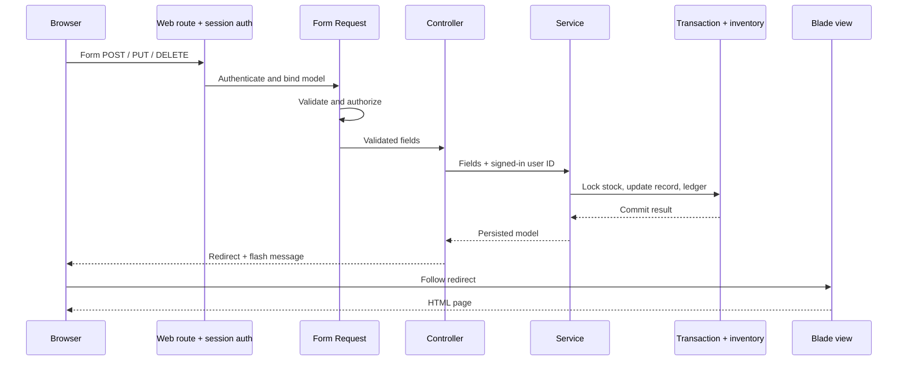

# Server-Rendered Purchase and Sales Flows

## Scope

The application uses Blade-rendered pages and Laravel web sessions. There is no JSON API surface. Sign in at `/login`; the dashboard, inventory, purchases, and sales pages are behind session authentication.

## Request Lifecycle

1. A browser submits a form to a named route in `routes/web.php`. The `auth` middleware requires a valid session. State-changing forms include a CSRF token.
2. Login is validated by `LoginRequest`. Purchase and sale create/update actions use their Form Requests, which authorize a signed-in user and validate foreign keys, product types, numeric precision, invoice lines, and payment totals. Validation failures redirect back with errors and old input.
3. A focused web controller loads the data needed for its Blade view or passes validated input and the authenticated user ID to the corresponding service.
4. `PaddyPurchaseService` or `SaleService` executes document, line, stock balance, and stock movement writes in a retryable database transaction. `InventoryService` locks product rows, rejects insufficient stock, updates balances, and records signed ledger movements. An exception rolls back all work in the transaction.
5. On success, the controller redirects to the resource detail/list page with a session flash message. Blade renders escaped model values and validation feedback.



## Browser Routes

| Method | URL | Purpose |
| --- | --- | --- |
| GET, POST | `/login` | Show and submit session login |
| POST | `/logout` | End the authenticated session |
| GET | `/` | Operations dashboard |
| GET | `/inventory` | Search and filter product stock |
| GET | `/inventory/{product}` | Product stock and movement history |
| GET, POST | `/purchases` | List and record a paddy receipt |
| GET | `/purchases/{purchase}` | Purchase receipt detail |
| GET | `/purchases/{purchase}/edit` | Edit purchase form |
| PUT | `/purchases/{purchase}` | Replace purchase details |
| DELETE | `/purchases/{purchase}` | Void receipt and reverse stock |
| GET, POST | `/sales` | List and create customer invoices |
| GET | `/sales/{sale}` | Invoice detail |
| GET | `/sales/{sale}/edit` | Edit invoice form |
| PUT | `/sales/{sale}` | Replace invoice and all lines |
| DELETE | `/sales/{sale}` | Void invoice and restore stock |

## Form Data

Purchase POST/PUT fields:

```text
supplier_id, product_id, purchase_date, quantity, unit_price,
paid_amount, moisture_percentage (optional), notes (optional)
```

The product must be `RAW_MATERIAL`. The server generates the purchase number, calculates total, and determines payment status.

Sale POST/PUT fields:

```text
customer_id, sale_date, paid_amount, notes (optional), items[]
items[][product_id], items[][quantity], items[][unit_price]
```

Sale products must be `FINISHED` or `BY_PRODUCT`; duplicate products are rejected. The server computes subtotals, invoice total, invoice number, and payment status. The sale form's browser total is only a preview; server validation and transaction checks are authoritative.

## Inventory and Transaction Rules

- Purchase receipts add stock and record a positive `purchase_in` movement.
- Sales subtract stock and record negative `sale_out` movements.
- Updating a document reverses its old stock effect and applies replacement values in the same transaction.
- Voiding soft-deletes transaction records and posts reversal movements, preserving audit history.
- A purchase update/void fails if the received stock has since been consumed and reversing it would produce a negative balance.
- Insufficient sale stock or invalid payments leave documents, lines, stock, and ledger unchanged.
- Product rows are locked in ascending ID order; Laravel retries deadlocked transactions up to three times.
- `stock_movements.quantity` is signed; `balance_after` stores the resulting product balance.

## Code Layers

- Routes: `routes/web.php`
- Login controller/request: `AuthController` and `LoginRequest`
- Purchase/sale web controllers: `app/Http/Controllers/Web/`
- Inventory web controller: `app/Http/Controllers/Web/InventoryController.php`
- Input validation: `app/Http/Requests/`
- Transaction services: `app/Services/`
- Server-rendered pages: `resources/views/`
- Feature tests: `tests/Feature/WebTransactionTest.php`, `InventoryFeatureTest.php`, and `DashboardTest.php`

Apply the soft-delete schema migration in existing environments with `php artisan migrate`.
